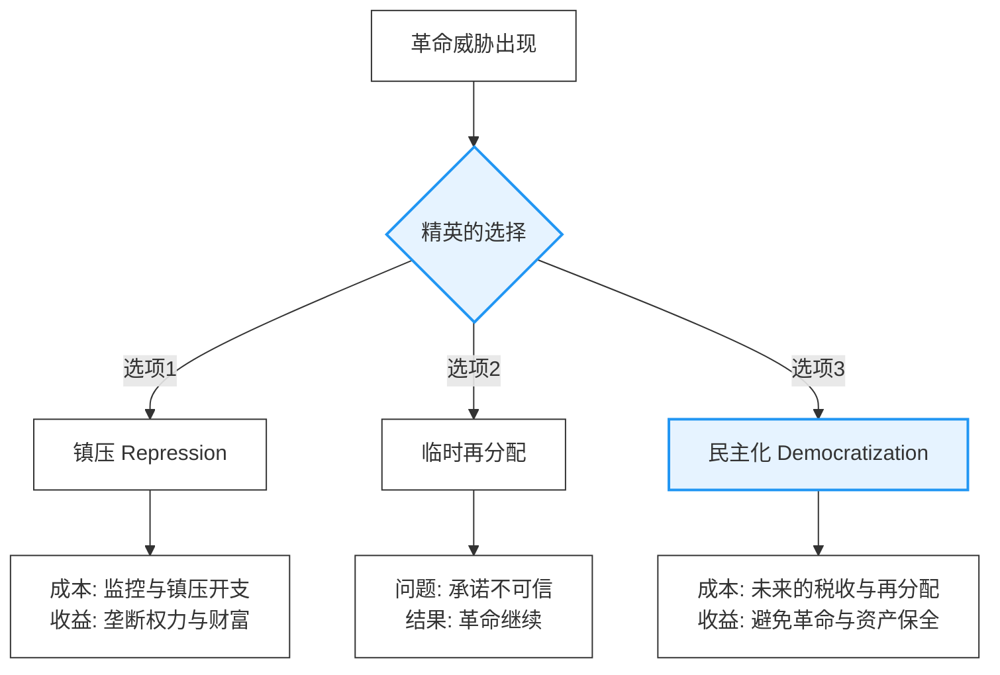

# 民主化的理论探索：从结构决定论到战略互动

## 引言：一个持续半个世纪的智识探险

在20世纪下半叶，没有哪个政治学问题比"为什么有些国家走向民主，而另一些国家陷入专制"更能吸引学者的注意力。这不仅是一个学术问题，更是一个关乎数十亿人命运的现实问题。从1974年葡萄牙康乃馨革命开启的"第三波民主化"浪潮，到1989年柏林墙倒塌后的东欧转型狂潮，再到21世纪初阿拉伯之春的短暂希望与随后的幻灭——民主化的进程从未停止震撼这个世界，而试图解释这一进程的理论也在不断演进、碰撞、重构。

这是一场跨越半个世纪的智识探险。在这场探险中，政治学家们提出了一系列雄心勃勃的假说：有人相信经济发展必然带来民主（现代化理论），有人强调精英的战略选择才是关键（转型范式），有人用博弈论的精密工具计算权力的转移（制度经济学），还有人在民主倒退的现实中反思整个理论大厦的基础（威权韧性研究）。

但这不仅仅是一部理论演进史。每一次理论转向的背后，都有鲜活的历史事件在提供证据或反证：为什么韩国在1987年实现了民主转型，而同样富裕的新加坡至今保持威权？为什么西班牙的转型如此平稳，而阿根廷却经历了反复的军事政变？为什么英国在19世纪逐步扩大选举权，而俄罗斯却在革命与反革命中循环？

本文将带你走进这场智识探险。我们将看到，政治科学如何像所有成熟的科学一样，通过理论与证据的对话，不断修正自己的认知。我们将理解，为什么早期的乐观主义让位于谨慎的现实主义，为什么宏大的结构叙事让位于精细的机制分析。更重要的是，我们将看到，这些理论争论如何照亮了政治转型的复杂现实——那些偶然与必然、结构与能动、算计与激情交织的历史时刻。

让我们从最初的乐观主义开始。

---

## 第一阶段：结构的乐观主义——现代化理论的兴衰

### 理论的诞生：李普塞特假说与发展-民主因果链

1959年，美国政治社会学家西摩·马丁·李普塞特（Seymour Martin Lipset）在《政治人》（*Political Man*）一书中提出了一个简洁而强大的命题：**经济发展导致民主**（Development → Democracy）。这个命题后来被称为"现代化理论"或"李普塞特假说"，它构成了战后民主化研究的第一个主要范式。

李普塞特的核心论证构建了一个从经济发展到民主制度的因果链条：**经济发展 → 社会结构变迁 → 文化价值转变 → 民主制度**。具体而言，经济发展带来工业化、城市化和教育普及，进而引发社会结构的变迁。随着中产阶级的壮大，传统精英的权力被稀释，社会变得更加多元。这种结构性变化进一步推动了文化价值的转变，受教育水平提高的公民培养出参与意识、宽容精神和理性讨论的习惯。这些条件的综合作用最终使民主制度成为可能且稳定。

这是一种典型的**结构决定论**：只要经济发展到一定水平，民主就会像水到渠成一样自然到来。政治制度被视为经济基础的"上层建筑"，政治行动者的选择空间被压缩到最小。

### 实证基础：早期的统计证据

李普塞特的理论并非凭空臆想，而是建立在扎实的实证研究之上。他通过跨国比较发现，在1950-60年代，**民主国家的人均GDP、识字率、城市化率、工业化水平**显著高于非民主国家。欧洲和拉丁美洲的数据显示，稳定民主国家的人均收入中位数约为**573美元**（1960年价格），而不稳定民主和独裁国家仅为**308美元**。在识字率方面，稳定民主国家平均达到**96%**，而独裁国家仅为**48%**。

这些相关性在当时看来异常稳健，后续的大量研究进一步强化了这一发现。最著名的是亚当·普沃斯基（Adam Przeworski）及其合作者在1990年代进行的大规模数据分析，覆盖了1950-1990年间135个国家的政治经济数据。普沃斯基发现了几个关键事实（Przeworski et al., 2000, *Democracy and Development*）：首先，存在一个"**民主存续的收入门槛**"，当人均GDP超过6000美元（1985年购买力平价）时，民主政体从未崩溃。在1950-1990年间，28个超过这一门槛的民主国家没有一个倒退为独裁。相比之下，贫穷国家的民主政体极其脆弱，人均GDP低于1500美元的民主国家，平均寿命仅为**8年**。

这些数据似乎为现代化理论提供了强有力的支持。在冷战的意识形态背景下，这一理论甚至被赋予了政策含义：帮助第三世界国家发展经济，最终将引导它们走向民主——这成为美国对外援助政策的一个重要理论支撑。

### 理论的精细化：因果机制的挖掘

但是，**相关性不等于因果性**。即使富裕国家更可能是民主国家，这也不能直接回答：是发展*导致了*民主，还是民主*促进了*发展？或者两者都是第三个变量（比如西方文化）的产物？为了回答这个问题，学者们开始深入挖掘**因果机制**，即经济发展究竟*通过什么途径*影响政治制度。现代化理论提出了几个关键机制。

首先是**阶级结构的重构**，即"中产阶级假说"。其理论逻辑在于，工业化创造出一个庞大的**城市中产阶级**（企业家、专业人士、白领工人）。这个阶级既有能力也有动机要求政治参与：他们有财产需要保护，有契约需要法治，有利益需要代表。随着传统的地主-农民二元结构被打破，社会变得**多元化**，任何单一集团都难以完全垄断权力。此外，中产阶级倾向于温和改革而非激进革命，为渐进民主化提供了社会基础。19世纪英国的改革法案与工业资产阶级的崛起，以及1960-80年代南欧和东亚的民主转型，都为这一假说提供了支持。然而，新加坡拥有庞大且富裕的中产阶级却保持威权，以及中东石油富国的情况，则构成了反常案例。

其次是**教育的政治效应**，即"公民文化假说"。这一观点认为，教育培养了**认知复杂性**，使受过教育的公民更能理解权力制衡、少数人权利等抽象政治概念。同时，教育促进了**宽容**，使接触多元思想的人更能接受政治对手的存在。此外，教育还增强了**政治效能感**，受教育者相信自己能够影响政治，因而更积极参与。虽然个人层面的调查数据持续显示教育水平与民主态度正相关，但跨国层面的情况更为复杂，如1930年代高教育水平的德国选择了纳粹。

最后是**经济复杂性与制度需求**，即"契约密集型经济假说"。现代经济需要**可信的产权保护**和**可执行的契约**，这要求独立的司法和对行政权力的约束。当经济变得高度专业化和相互依赖时，独裁者的**承诺问题**（commitment problem）变得严重，因为他们随时可以违约。而民主的**制度化约束**（如宪法、分权）提供了一种解决方案。诺斯（North）和温格斯特（Weingast）等经济史学家用英国光荣革命后的制度变迁说明了这一机制，但许多发展中国家（如中国、越南）的经验显示，经济增长可以在威权体制下持续很长时间。

### 理论遭遇的第一批异常：内生性问题与外生性区分

然而，就在现代化理论如日中天之时，实证研究开始发现一些令人不安的**异常**。

首先是普沃斯基提出的"外生-内生"区分。他在1990年代的大规模统计分析中得出了一个**意外的结论**：**经济发展不能预测一个国家会不会从独裁转向民主（"外生民主化"），但能够预测一个已经是民主的国家会不会保持民主（"内生民主化"）。** 换句话说，从独裁到民主的转变似乎与发展水平**无关**，在各个收入水平上，独裁政权转型为民主的概率大致相同。然而，民主政权能否存续则**强烈依赖**于发展水平。富裕的民主国家几乎不会倒退，而贫穷的民主国家极其脆弱。数据显示，1950-1990年间，在人均GDP低于1000美元的国家，民主政权的年度崩溃率约为**12.3%**；在4000-6000美元之间降至**3.8%**；而超过6000美元的国家崩溃率为**0%**。这个发现**颠覆了传统现代化理论**：发展不是民主的**因**（cause），而是民主的**保护伞**（protector）。这意味着经济增长不会自动带来民主转型，但一旦通过其他途径实现了民主，经济发展能大大提高其存续概率。

其次是租金国家悖论，即"资源诅咒"。如果经济发展导致民主，那么石油富国应该是民主的典范，但现实恰恰相反。根据罗斯（Ross）等人的理论，**租金国家**（Rentier State）的收入主要来自自然资源出口租金，而非对国内经济的征税。这导致了租金与税收的政治差异：税收需要**谈判**，遵循"无代表不纳税"的逻辑，使得征税政府必须向纳税人负责；而租金不需要谈判，政府可以用石油收入收买忠诚、镇压反对，而无需征得同意。实证证据表明，中东北非地区的海湾君主制人均GDP虽高，但政治制度停留在传统威权。统计分析显示，**石油出口占GDP比例每增加10个百分点，独裁政权存续时间延长约4年**。相比之下，挪威和荷兰等国是**先民主化，后发现石油**，因此民主制度已经巩固，租金无法改变政体。

第三是东亚发展型国家的"威权增长奇迹"。如果经济发展必然带来民主化压力，那么东亚的快速增长国家应该很快民主化。但现实更加复杂。韩国和台湾在1987年左右实现了转型，当时处于中等收入水平，且转型后高度稳定。然而，新加坡和中国大陆的情况则不同：新加坡人均GDP远超普沃斯基的"6000美元门槛"，却未发生民主转型；中国大陆在中低收入水平下也保持了威权稳定。这些差异引发了对地缘政治、反对派力量、精英分裂以及制度设计等因素的思考。这些异常案例暗示：**经济发展只是故事的一部分，政治行动者的战略选择、国际环境、制度遗产可能同样重要甚至更重要**。

### 理论的反思：现代化理论错在哪里？

到1980-90年代，现代化理论面临严重的信誉危机。批评主要集中在三个方面。首先是**决定论的傲慢**。现代化理论暗含一种**历史目的论**，认为所有国家都将沿着同一条路径前进，忽视了**路径依赖**、**制度多样性**以及政治行动者的**能动性**。其次是**文化本质主义的陷阱**。一些变种理论将民主归因于"新教伦理"等西方特质，导致了**循环论证**和**静态文化观**，忽视了文化的变迁性。最后是**忽视了权力与利益**。现代化理论过于强调"无痛"的社会变迁，低估了从独裁到民主过程中的**零和冲突**、技术进步带来的**镇压可能性**以及冷战期间的**国际因素**。

### 余绪：现代化理论的遗产

尽管存在这些问题，现代化理论并未完全消亡。它的核心洞见——**经济发展与民主之间存在某种深刻联系**——仍然得到数据支持。但这种联系被重新诠释：首先，这**不是单向因果，而是共同进化**，民主与发展可能相互强化；其次，这**不是自动机制，而是条件概率**，发展提高了民主化的概率和稳定性，但不保证转型；最后，这**不是单一路径,而是机制丛**，中产阶级、教育、契约需求等多个机制可能在不同情境下发挥作用。更重要的是，现代化理论的失败开启了新的研究议程：**如果结构不能决定一切，那么政治行动者如何在约束中创造历史？** 这将我们带入下一个阶段：转型范式与精英能动性的回归。

---

## 第二阶段：精英的能动性——转型范式的兴起

### 理论转向的时代背景：第三波民主化的冲击

1974年4月25日，葡萄牙发生了一场几乎没有流血的军事政变，史称"康乃馨革命"。这场政变推翻了维持48年的萨拉查-卡埃塔诺独裁政权，开启了西欧最后一个独裁国家的民主转型。但这仅仅是个开始。在接下来的二十年里，全球见证了一波席卷三大洲的民主化浪潮。南欧的葡萄牙、西班牙和希腊在1970年代中后期率先转型；随后，拉丁美洲的厄瓜多尔、秘鲁、阿根廷、乌拉圭、巴西和智利在1980年代相继回归民主；东亚的菲律宾、韩国和台湾也在1980年代末加入这一行列；最后，1989年至1991年间，东欧与前苏联地区的波兰、匈牙利、东德、捷克斯洛伐克等国经历了剧变，苏联最终解体。塞缪尔·亨廷顿（Samuel Huntington）将这一现象命名为"**第三波民主化**"（The Third Wave），以区别于19世纪的第一波和二战后的第二波。

这一波民主化对现代化理论构成了致命挑战。首先是**时机不对**，许多国家（如阿根廷、巴西）在1960-70年代经历了快速增长，但那时是军事独裁的巩固期，真正的民主化反而发生在1980年代的经济危机中。其次是**收入水平不对**，许多拉美国家的转型发生在中等收入水平，远未达到普沃斯基后来识别的"安全门槛"。此外，民主化在短时间内集中爆发于特定地区的**地区集中性**，以及许多转型由突发事件（如战争失败、暗杀）触发的**偶然性**，都难以用经济发展的自然结果来解释。这些经验事实呼唤一种新的理论视角：**民主转型不是经济发展的自动产物，而是政治行动者在不确定性中做出的战略选择的结果**。

### 转型范式的核心：奥唐奈与施密特的理论

1986年，吉列尔莫·奥唐奈（Guillermo O'Donnell）和菲利普·施密特（Philippe Schmitter）出版了四卷本《从威权统治的转型》的第一卷《关于不确定民主的试探性结论》。这部著作成为"转型范式"（Transitology）的奠基之作。

奥唐奈和施密特首先强调，**不确定性是转型的本质**。他们指出："政治转型是由不确定性定义的时刻。在这些时刻，行动者的选择——而非宏观结构——变得至关重要。"这是对现代化理论的直接挑战：现代化理论强调决定论，而转型范式强调偶然性。这种不确定性体现在三个维度：**结果不确定**（可能通向民主，也可能回到独裁或内战）、**规则不确定**（游戏规则本身在被重新谈判）以及**身份不确定**（盟友与敌人的关系随时可能转换）。

其次，转型范式认为**精英分裂是转型的起点**。转型往往不是从"人民的觉醒"开始，而是从威权联盟内部的分裂开始。威权政权内部通常存在两个派系：**硬派**（Hard-liners）相信威权统治必须无限期维持，偏好镇压而非妥协，通常由军队强硬派和安全机构构成；**软派**（Soft-liners）则认识到现有统治方式不可持续，偏好"自由化"而非全面"民主化"，希望通过有限开放来延续威权的合法性，通常由技术官僚和温和保守派构成。

**分裂的动力学**：
```
威权联盟
    ↓（危机触发：经济、战争、继承）
硬派 vs 软派
    ↓（软派占上风）
"从上而下的自由化"
    ↓（意外后果）
反对派动员 → 社会压力
    ↓（软派面临两难）
与温和反对派结盟 vs 回归镇压
    ↓（协议达成）
民主转型
```

软派最初并不想要民主，他们只想要"有限的自由化"——放松一些控制以缓解压力，但保留威权的核心。然而，一旦打开潘多拉的盒子，他们往往无法控制后果。

最后，**协议是转型的机制**。如何从精英分裂走向民主？关键在于**协议达成**（Pact-making）。协议是政治行动者之间为了管理不确定性而进行的谈判。其核心功能在于：通过保证旧精英的核心利益（如财产权、免责）来**降低转型成本**；通过温和反对派与软派的结盟来**管理激进化风险**；以及在规则不确定的时刻创造**可信承诺**。典型的协议内容包括选举时间表等程序性保证，以及大赦条款、军队自主性等实质性保证。

### 实证基础：转型范式的经典案例

转型范式的力量在于它对具体历史过程的精细描述。让我们看几个关键案例。

#### 案例1：西班牙——"协议式转型"的典范

西班牙的转型被广泛认为是第三波中最成功的案例，也是转型范式理论的最佳印证。1975年11月，独裁者佛朗哥去世，统治西班牙39年的法西斯政权进入真空期。国王胡安·卡洛斯一世继位，面对着深刻分裂的社会。此时，精英内部出现了分裂：以法西斯残余势力为代表的**硬派**试图维持现状，而以首相阿道弗·苏亚雷斯为代表的**软派**则主张改革。国王选择支持改革派，成为关键的"仲裁者"。

1977年10月，西班牙主要政党在总理府达成了著名的**蒙克洛阿协议**（Moncloa Pacts）。这是一系列涵盖经济与政治的共识：各方同意实施经济紧缩政策以应对危机，承诺在宪法制定中寻求共识而非单方面优势，保证军队的专业自主性以避免触及内战记忆，并承认加泰罗尼亚等地区的自治诉求。这一协议铺平了道路，1978年宪法获得全民公投压倒性支持。尽管1981年曾发生未遂政变，但很快被平息。1982年，西班牙完成了首次和平的左右政权交替。西班牙的成功在于软派的主动引导、协议的包容性、国王的中介角色以及对内战惨痛记忆的共同反思。

#### 案例2：巴西——"渐进式转型"的悖论

与西班牙的快速转型不同，巴西经历了长达十年的"开口"（*abertura*）过程（1974-1985）。巴西的自由化最初是**军方内部软派的战略**。1974年，总统盖泽尔启动了"缓慢、渐进、安全的开口"，目标是通过有限放松来恢复军政权的合法性，而不是放弃权力。然而，这一过程引发了意外的滚雪球效应。1974年选举中反对派的大胜、1970年代末的劳工运动以及1980年代初要求直选的群众运动，都超出了军方的预期。

最终，军方被迫妥协，允许在1985年进行间接选举，产生了文官总统。巴西的转型协议具有鲜明的特点：它包含了一个不成文的交换，即通过1979年大赦法赦免军政权的罪行，换取军方逐步撤出政治；同时，军方在转型后仍保留了相当大的自主权。这种渐进主义虽然避免了流血，但也付出了代价：转型时间过长导致民主巩固滞后，且"控制式自由化"一旦开启便难以由精英完全掌控。

#### 案例3：阿根廷——转型失败的教训

阿根廷提供了一个对照案例。1982年，军政府为挽救合法性发动马岛战争，结果惨败，导致威信彻底崩溃，被迫举行选举。与西班牙和巴西不同，阿根廷的转型**缺乏协议**。反对派领袖阿方辛以清算军政府为竞选纲领，拒绝大赦交换。这导致了1985年对军政府高层的审判，但也引发了军方的多次叛乱。

此外，阿根廷新生的民主政权还面临着恶性通胀的挑战，1989年通胀率一度达到3079%，导致阿方辛提前卸任。继任的梅内姆总统虽然实施了改革，但也赦免了军政府成员，引发社会分裂。阿根廷的经历表明，协议的缺失可能导致不稳定，清算正义与政治稳定之间存在张力；同时，经济绩效对新民主至关重要，贫穷的民主政体往往极其脆弱。

### 转型范式的理论贡献与局限

#### 理论贡献：能动性的回归

转型范式的最大贡献在于**将行动者带回理论中心**。它用战略互动取代了结构决定论，认为民主转型是"可能"的而非"必然"的；它用细致的过程追踪取代了大样本回归，揭示了转型的因果机制；它还为转型国家提供了关于协议重要性和渐进主义的可操作建议。

**转型范式的核心机制总结**：

```
威权政权
    ↓
（危机触发）
    ↓
精英分裂（硬派 vs 软派）
    ↓
自由化（liberalization）≠ 民主化（democratization）
    ↓
反对派动员（意外后果）
    ↓
软派的两难：镇压 vs 谈判
    ↓
协议达成（Pact-making）
    │
    ├─ 程序保证（选举、宪法）
    ├─ 实质保证（大赦、自主权）
    └─ 共同遏制极端派
    ↓
民主转型（但质量取决于协议内容）
```

#### 理论局限：成功的偏见与遗漏的变量

但到1990年代，转型范式也开始遭遇批评。首先是**选择偏差**，该理论主要基于南欧和拉美的成功案例，可能存在"成功的偏见"，忽视了失败的谈判。其次是**低估了结构约束**，仿佛只要精英愿意就能民主化，而忽视了种族、经济等结构性因素。第三是**忽视了社会力量**，过于强调精英博弈，低估了自下而上的劳工和学生运动的推动力。第四是**"东欧例外"的挑战**，1989年东欧的转型更多是受外部冲击（苏联撤退）影响，且往往是政权突然崩溃而非渐进谈判，这与转型范式的假设不符。最后是对**"民主质量"的忽视**，许多通过协议实现的转型产生了"委任民主"或保留了威权遗产，导致民主质量低下。

### 余绪：从转型到巩固

到1990年代中期，政治学的焦点从"如何转型"转向"如何巩固"。学者们意识到，举行选举不等于建立民主制度，协议虽然短期内促进稳定，长期却可能阻碍深化。这呼唤一种新的理论视角，能够解释为什么有些新民主巩固了而有些倒退了，以及是什么决定了精英的策略选择。这些问题将我们引向第三阶段：博弈论与制度经济学的登场。新一代学者试图用更精密的理论工具——特别是**承诺问题**（commitment problem）和**制度的自我强化**（self-enforcing institutions）——来解释民主转型与巩固的逻辑。

---

## 第三阶段：权力的算计——制度主义与博弈论的登场

### 理论转向的背景：从叙事到形式化

到1990年代末，民主化研究面临一个尴尬的局面：我们有大量精彩的历史叙事，但缺乏一般性理论。每个案例都被描述为独特的，西班牙的经验似乎无法推广到韩国，巴西的教训也不适用于波兰。转型范式强调"不确定性"和"偶然性"，但这几乎等于放弃了科学预测的雄心。

同时，一些根本问题仍未得到解答。首先，**为什么精英会分裂？** 转型范式将精英分裂作为起点，但没有解释其根源。是什么条件使软派出现？为什么有时硬派占上风？其次，**为什么协议能够自我执行？** 在没有第三方强制执行的情况下，为什么政治行动者会遵守协议？今天的赢家为什么不在明天撕毁承诺？最后，**经济发展的角色到底是什么？** 普沃斯基证明发展不导致转型但保护民主，可是背后的因果机制是什么？这些问题呼唤一种新的理论工具：**博弈论**和**制度经济学**。新一代学者开始用数学模型重构民主化理论，试图在"结构"与"能动性"之间找到微观基础。

### 阿西莫格鲁与罗宾逊：民主化的经济逻辑

2006年，达龙·阿西莫格鲁（Daron Acemoglu）和詹姆斯·A·罗宾逊（James A. Robinson）出版了《独裁与民主的经济起源》。这部著作成为民主化研究"制度转向"的里程碑。与之前的理论不同，阿西莫格鲁-罗宾逊（以下简称AR）的核心工具是**非合作博弈论**。他们将民主化建模为理性行动者在制度约束下的战略互动：精英控制政治权力，害怕失去财富；公民拥有潜在的集体行动能力（革命威胁），但缺乏政治权力；民主是两者博弈的**均衡结果**，而非道德觉醒或文化演进。

#### 核心命题1：民主化的根本问题是"承诺问题"

AR理论的起点是一个看似简单的问题：**为什么精英不能通过临时性的再分配来避免民主化？** 假设一个威权国家面临革命威胁，理性的精英可以选择做出政策让步（增加福利、减税）来平息不满，或者进行制度改革（民主化）永久性地分享权力。显然，保留权力但暂时让利对精英更有利。那么，为什么精英会选择民主化？

AR的答案在于**承诺问题**（Commitment Problem）。关键是**时间不一致性**：今天面对公民动员，精英承诺再分配；但明天威胁消退后，精英就会撤回承诺并进行秋后算账。理性的公民知道精英会背叛，所以不相信临时承诺。因此，唯一可信的承诺是**制度化的权力转移**，即民主。民主赋予公民未来的否决权，创造透明性，并具有制度惰性。用一句话总结：**民主是精英为了避免革命而绑住自己双手的承诺装置。**

#### 核心命题2：民主化的决策树——成本-收益算计

AR将民主化建模为精英在多个选项中的理性选择。简化的决策树如下：



**关键决策逻辑**：精英最终的选择取决于 `Cost(Repression)`（镇压成本）与 `Cost(Democratization)`（民主化成本）的比较。

**关键不等式**：民主化发生当且仅当镇压的成本（包括革命成功的风险）大于民主化带来的未来财富损失。

#### 核心命题3：经济发展的作用——改变算计的参数

现在我们可以重新理解经济发展与民主的关系。AR认为，发展通过**改变上述不等式的参数**来影响民主化。

首先，发展**提高了镇压成本**。城市化使人口集中，易于组织且难以镇压；教育提高了公民的组织能力；庞大的中产阶级成为难以全面镇压的群体。其次，发展**降低了民主化成本**。当财富从土地转向人力资本和金融资产时，精英对民主的恐惧降低，因为这些资产更难被征收。此外，经济相互依赖和宪政主义文化也降低了激进再分配的风险。最后，发展**提高了革命的机会成本**。生活水平的提高和对未来的增长预期降低了革命的吸引力。

综合效应是，在中等收入水平，民主化最可能发生：此时公民有能力组织（革命威胁大），但精英尚未完全摆脱对再分配的恐惧（民主化成本仍高）。这解释了普沃斯基的"外生-内生"之谜：转型发生在中等收入，而巩固需要高收入。

### 实证基础：历史的博弈论重读

AR的理论不仅是抽象模型，他们用大量历史案例来"校准"参数。让我们看两个关键案例。

#### 案例1：19世纪英国——选举权的渐进扩展

英国是民主化研究的经典案例，因为它展示了长期渐进式的制度变迁。从1832年的第一次改革法案到1928年的全面成人普选权，英国精英一次又一次地同意扩大选举权。

根据AR的博弈论解释，每一次改革都是在**革命威胁足够大但镇压成本过高**的时刻发生的。1832年，面对法国大革命的示范效应和国内骚乱，辉格党中的改革派意识到小步让步优于全面崩溃，而工业化导致的城市人口集中也降低了传统镇压手段的效率。因此，他们通过了有限的改革法案，将选民扩大到城市中产阶级，以分化反对派。到了1867年，随着城市工人阶级的壮大，保守党为了争取新选民，主动推动了第二次改革。1918年，一战的大规模征兵和劳工运动的崛起，加上财富形式从土地转向金融资本，使得精英最终接受了全面普选权。这一过程显示了精英通过**渐进式让步**避免激进革命的策略，以及制度的路径依赖性。

#### 案例2：南非——种族隔离的终结

南非提供了一个更极端的案例：一个少数族裔精英如何最终同意将权力交给多数？1990年，总统德克勒克宣布解除非国大禁令，释放曼德拉，最终在1994年实现了首次多种族选举。

AR的分析指出，1990年的南非处于博弈的临界点。一方面，**镇压成本急剧上升**。国际制裁导致经济增长停滞，黑人乡镇的持续骚乱和边境战争拖累了财政，维持警察国家的开支不断攀升。另一方面，**民主化的成本通过谈判大幅降低**。南非经济结构从易被国有化的采矿业转向金融和制造业，白人精英将资产转移或转化为人力资本。同时，德克勒克与曼德拉的谈判达成了多项制度保障，包括宪法对产权的保护、过渡期的权力分享以及不清洗公务员系统。曼德拉的温和路线和非国大放弃国有化纲领的承诺，进一步降低了白人的恐惧。最终，白人精英选择了民主化，虽然失去了政治垄断，但保住了大部分财富，避免了内战。

### 理论的精细化：制度的自我强化与均衡选择

AR理论的一个深刻洞见是：**民主和独裁都可以是自我强化的均衡**。

一旦建立，民主能够存续是因为它是一种**协调均衡**。如果大多数人相信民主会持续，选举的失败者会接受结果，军队会保持中立，投资者会长期投资。这种相互强化的信念使民主自我维持。此外，民主制度建立后，政变需要军队配合且面临国际制裁，**逆转成本很高**，创造了制度惰性。经济增长的良性循环也进一步巩固了民主。

同样，独裁也可以稳定。如果大家都相信独裁者强大，没人敢反抗，军队和官僚保持忠诚，这形成了一种**恐惧的均衡**。独裁者还可以通过分配租金收买精英忠诚，创造既得利益联盟。现代监控技术的进步进一步降低了镇压成本，使独裁在高收入水平上也可能稳定。

AR模型的一个重要含义是，给定相同的经济条件，可能存在多个稳定均衡。这意味着**历史偶然性**仍然重要，它决定了哪个均衡被"选中"；而**路径依赖**意味着一旦进入某个均衡，很难跳转到另一个。

### 理论的贡献与局限

#### 理论贡献：微观基础的建立

AR理论的最大贡献在于为民主化研究提供了**微观基础**。它建立了理性选择的清晰逻辑，生成了可检验的预测，统一了结构与能动性，并解释了新加坡等"例外"案例。

**关键贡献总结**：

| 问题 | 早期理论 | AR理论 |
|------|---------|--------|
| 为什么发展→民主？ | 文化变迁（现代化理论） | 改变成本-收益参数 |
| 为什么精英接受民主？ | 价值观转变（规范理论） | 比镇压/革命成本更低 |
| 为什么需要制度化？ | 未明确解释 | 解决承诺问题 |
| 为什么民主能巩固？ | 文化深化 | 自我强化均衡 |
| 经济危机的作用？ | 矛盾（削弱独裁vs削弱民主） | 提高革命威胁但也提高民主化成本 |

#### 理论局限：过度简化的代价

但AR理论也面临严厉批评。首先是**过度理性化**，假设所有行动者都是完全理性的算计者，忽视了意识形态、情感和认知偏差的作用。其次是**二元化的简化**，模型中只有"精英"和"公民"，忽视了军队、中产阶级等多元行动者以及精英内部的异质性。第三是**制度起源的循环论证**，解释了民主如何自我强化，但未解释第一个民主制度如何出现。第四是**忽视了意识形态与合法性**，过于强调物质力量，低估了合法性的作用。第五是**对"民主质量"的漠视**，关注程序性民主的建立，忽视了实质性民主，导致将选举威权误判为民主。最后是**文化与历史的缺位**，模型是"时间无关"的，忽视了全球规范演变的影响。

### 余绪：博弈论的遗产与新议程

尽管存在这些局限，AR理论及其博弈论方法深刻改变了民主化研究。它推动了方法论从归纳式叙事转向演绎式模型，从变量相关性转向因果机制，从单一学科转向跨学科。这也开启了新的研究议程，包括民主巩固的微观机制、威权韧性、民主倒退以及国际因素的建模。这些问题将我们带入第四阶段：21世纪的现实检验——民主倒退与威权韧性的时代。

---

## 第四阶段：现实的检验——民主倒退与威权韧性

### 时代转折："历史的终结"幻觉的破灭

1989年11月9日，柏林墙倒塌。1991年12月25日，苏联解体。在这些震撼世界的时刻，一种乐观主义情绪弥漫于西方学界和政策圈：自由民主制度似乎取得了最终胜利。弗朗西斯·福山（Francis Fukuyama）在1992年出版的《历史的终结与最后的人》中宣称，我们正在见证人类意识形态演化的终点和西方自由民主作为人类政府最终形式的普遍化。

这种乐观主义有一定的经验基础。1990年代，民主国家的数量持续增长，从1988年的69个增加到2000年的120个。许多第三波民主国家（如南欧、东欧）加入欧盟和北约，制度似乎已经锁定。苏联的崩溃似乎也证明，威权制度在现代经济条件下不可持续。但仅仅十年后，这种乐观主义就开始破裂。

### 新现实的浮现：民主的停滞与倒退

从2005年左右开始，全球民主化的趋势出现了逆转。根据自由之家（Freedom House）和V-Dem研究所的数据，2006年至2020年间，世界上民主倒退的国家数量连续15年超过民主化的国家数量。即使在保持选举的国家，公民自由和政治权利等自由度分数也在下降。与此同时，中国、俄罗斯、中东君主制等威权政权不仅存续，而且在经济增长和社会稳定等方面表现出惊人的韧性。

这一时期出现了一系列新现象。首先是**选举威权的普及**，越来越多的国家保持选举形式，但实质上是威权统治。其次是**民主倒退**（Democratic Backsliding），已经巩固的民主国家（如匈牙利、土耳其）开始倒退。第三是**数字威权主义**的兴起，新技术使威权统治更加高效和隐蔽。最后是**民粹主义的挑战**，即使在美国、法国等老牌民主国家，民主规范也在受到侵蚀。这些现象对既有理论构成了严峻挑战：如果现代化理论是对的，为什么高收入的中国仍保持威权？如果转型范式是对的，为什么委内瑞拉会倒退？如果AR理论是对的，为什么匈牙利会经历"去民主化"？

### 新理论1：竞争性威权主义——灰色地带的政治学

2010年，史蒂文·莱维茨基（Steven Levitsky）和卢坎·A·韦（Lucan A. Way）出版了《竞争性威权主义：冷战后的混合政权》，系统性地研究了一种新型政体：**竞争性威权主义**。

竞争性威权体制是一种混合政权，其中形式上的民主制度（定期选举、多党竞争、独立媒体）存在，但竞争场域严重倾斜，使得在野党赢得权力极其困难但并非不可能。这与传统威权不同，后者根本没有真实竞争；也与民主不同，后者的竞争是公平的。莱维茨基和韦识别了四个关键维度：**选举场域的倾斜**（反对派资源劣势、媒体不对称、选举操纵）、**公民自由的有限性**（言论自由受法律压制、集会受限）、**竞技场的不平等**（司法不独立、选举机构被操纵）以及**暴力的选择性使用**（针对关键反对派领袖的骚扰而非大规模镇压）。

竞争性威权之所以流行，是因为它在国际合法性与国内控制之间达到了巧妙平衡。在冷战后，民主成为国际合法性的货币，完全的威权会引发西方反应。因此，保持选举的形式足以欺骗国际社会。在国内，保持选举形式可以分化反对派，温和派会选择参与从而获得合法性，而激进派则被边缘化。

莱维茨基和韦提出了**连接（Linkage）与杠杆（Leverage）**的理论框架，解释政权的命运。连接指一个国家与西方的联系密度，杠杆指西方施加压力的能力。

| 连接/杠杆 | 高杠杆 | 低杠杆 |
|----------|--------|--------|
| **高连接** | **民主化**（东欧）：西方压力+国内亲西方力量 → 转型 | **不稳定的威权**（乌克兰）：国内分裂，反复拉锯 |
| **低连接** | **表面遵从**（撒哈拉以南非洲）：接受西方援助条件，但阳奉阴违 | **稳定的威权**（中国、俄罗斯）：既不依赖西方，也不惧制裁 |

### 实证案例：委内瑞拉——从竞争性威权到霸权威权

委内瑞拉提供了一个经典案例，展示竞争性威权如何逐步关闭。1998年，查韦斯通过民主选举上台，开启了"玻利瓦尔革命"。在1999-2004年间，他建立了竞争性威权，通过制宪会议重写宪法削弱制衡，利用石油收入资助社会项目换取支持，并控制选举委员会。尽管如此，2004年的罢免公投仍有真实竞争。

2005-2012年间，竞争空间开始收缩。政府不再续发RCTV电视台执照，通过法律禁止部分反对派参选，并将经济武器化，解雇政治立场不同的公务员。到了2013年马杜罗上台后，政权进一步巩固为**霸权威权**。面对合法性危机，马杜罗绕过议会建立"制宪大会"，禁选或监禁主要反对派领袖，导致2018年和2020年的选举成为橡皮图章。

查韦斯/马杜罗政权之所以能巩固，是因为**低国际杠杆**（石油收入使其不依赖西方）、**低西方连接**（反美意识形态削弱了亲西方力量）以及**国内机制**（军队的收买、底层民众的支持和反对派的分裂）。

### 新理论2：民主倒退——民主如何死亡？

如果说竞争性威权研究的是"从未真正民主化的国家"，那么**民主倒退**研究的是"曾经巩固但现在倒退的民主国家"。莱维茨基和丹尼尔·齐布拉特（Daniel Ziblatt）在《民主如何死亡》中指出，当代的民主倒退与20世纪的军事政变不同，它往往披着合法的外衣，由民选领袖发动，是一个渐进的侵蚀过程，且在相当长时间内得到民众支持。**民主今天更可能在投票箱中死去，而非在街垒上。**

民主倒退的关键机制是**行政扩权**，即民选领导人通过看似合法的手段削弱制衡。主要策略包括：**捕获裁判**（如匈牙利和波兰的司法堆积、操纵选举机构）、**边缘化对手**（如土耳其和俄罗斯的法律武器化、选举规则操纵）、**改写规则**（如委内瑞拉和卢旺达取消任期限制）以及**控制私营领域**（如匈牙利和俄罗斯的媒体集中化、打压NGO）。

这种倒退的社会基础往往是**民粹主义**。民粹主义者将社会划分为"纯洁的人民"对抗"腐败的精英"，这种反多元主义为压制反对派提供了道德理由。他们还攻击制衡机制为"精英的工具"，并将权力集中于个人魅力，削弱制度自主性。匈牙利的奥尔班是典型案例：他利用议会多数通过新宪法，削弱法院，控制媒体，煽动反移民情绪，最终建立了"非自由民主"。

### 新理论3：数字威权主义——21世纪的监控国家

技术进步不仅没有促进民主，反而为威权主义提供了新工具。**数字威权主义**利用数字信息技术来监视、压制和操纵人口。它依靠三大支柱：**全面监控**（如中国的"天网"和新疆的预测性治安）、**信息操纵**（如俄罗斯的"不可知宣传"和中国的舆论引导）以及**社会信用系统**（通过综合评分进行软控制）。

数字威权比传统威权更稳定，因为它能进行外科手术式的**精准镇压**，降低了成本；它能营造表面正常，维持**合法性**；它通过算法实现了更高效的**信息垄断**。此外，中国还通过"数字丝绸之路"向全球80多个国家出口监控技术和管理经验，创造了**威权学习**的效应。这打破了"技术中性"的神话，挑战了现代化理论。

### 理论综合：对既有范式的挑战与修正

21世纪的经验事实迫使学者们重新思考民主化理论。首先是对**现代化理论**的反思：高收入威权国家的稳定表明，财富类型（租金vs制造）、中产阶级的性质（依附vs自主）以及技术的控制权可能比单纯的GDP更重要。其次是对**转型范式**的再审视：协议转型的民主倒退表明，对旧精英的过度保护可能留下负面遗产，而经济危机和国际环境的变化也削弱了民主的吸引力。最后是对**博弈论模型**的质疑：理性选择模型低估了意识形态和权力欲的作用，忽视了国际因素，且未能有效解释从民主倒退回威权的机制。

### 未来的研究议程：开放的问题

半个世纪的理论演进告诉我们，政治转型的科学仍在进行中。未来的研究需要关注：数字威权的长期稳定性及技术的影响；民主倒退的可逆性及抵御民粹主义的制度设计；以及如何将结构、能动性、文化和国际因素整合为统一理论。比较政治学或许需要从追求"科学预测"转向更深度的"情境理解"。

### 结语：从确定性到不确定性，再到谦卑的认知

回顾这场跨越半个世纪的智识之旅，我们见证了一个学科如何在经验证据的冲击下不断演进：从1960年代相信经济发展必然导向民主的**现代化理论**，到1980年代强调精英选择决定结果的**转型范式**，再到2000年代试图寻找微观基础的**博弈论模型**，最后到2010年代面对**威权韧性**的现实提醒。

这个演进过程本身揭示了科学的本质：**不是对最终真理的占有,而是对错误认知的持续修正**。每一代理论都在当时看似完美，却在新现实面前暴露出局限。但这并非失败，而是进步：我们对因果机制的理解变得更精细，对多元路径的认识更深刻，对复杂性的尊重更谦卑。

最重要的教训是：政治转型既不是经济发展的自动产物，也不是完全偶然的，更不是纯粹理性算计的结果。它是**结构约束、制度遗产、行动者选择、文化意义、国际环境、技术变迁**等多重力量复杂互动的产物。对于理解我们所处的时代，这意味着：**没有历史的必然性**，民主不会自动胜利；**制度设计很重要**，可以抵御侵蚀；**警惕需要持续**，民主是需要维护的实践；**国际合作至关重要**。

最后，这场智识之旅提醒我们：**社会科学的价值不在于提供确定的预测，而在于照亮复杂现实的多重面向，帮助我们在不确定性中做出更明智的选择**。民主的未来不是写在经济发展的曲线上，不是锁定在历史的路径中，也不是由博弈论的均衡决定——它在每一个关键时刻，在每一代人的选择中，持续地被重新书写。

---

**全文完**

*本文系统性回顾了民主化理论从1950年代至今的演进，展示了政治科学如何通过理论与证据的对话不断深化认知。从现代化理论的结构决定论，到转型范式的战略互动，再到博弈论的微观基础，最后到威权韧性与民主倒退的现实挑战——这是一场尚未结束的智识探险，也是理解我们这个时代政治变迁的必要准备。*

---

## 参考文献与进一步阅读

以下按理论阶段和主题分类列出核心著作与重要论文，方便读者根据兴趣深入探索。

### 第一阶段：现代化理论

**奠基性著作**：

- **Lipset, Seymour Martin. 1959.** "Some Social Requisites of Democracy: Economic Development and Political Legitimacy." *American Political Science Review* 53(1): 69-105.
  - 现代化理论的开山之作，提出经济发展与民主的相关性

- **Lipset, Seymour Martin. 1960.** *Political Man: The Social Bases of Politics*. New York: Doubleday.
  - 系统阐述现代化理论，分析阶级结构、教育与民主的关系

- **Almond, Gabriel A., and Sidney Verba. 1963.** *The Civic Culture: Political Attitudes and Democracy in Five Nations*. Princeton: Princeton University Press.
  - 公民文化理论，探讨政治态度与民主稳定性

**批判与修正**：

- **Przeworski, Adam, Michael E. Alvarez, José Antonio Cheibub, and Fernando Limongi. 2000.** *Democracy and Development: Political Institutions and Well-Being in the World, 1950-1990*. Cambridge: Cambridge University Press.
  - 大规模数据分析，提出"外生-内生民主化"区分，颠覆传统现代化理论

- **Przeworski, Adam, and Fernando Limongi. 1997.** "Modernization: Theories and Facts." *World Politics* 49(2): 155-183.
  - 经典论文，用统计证据检验现代化理论

- **Ross, Michael L. 2001.** "Does Oil Hinder Democracy?" *World Politics* 53(3): 325-361.
  - 租金国家理论，解释"资源诅咒"现象

- **Beblawi, Hazem, and Giacomo Luciani (eds.). 1987.** *The Rentier State*. London: Croom Helm.
  - 租金国家的系统性研究

**中国读者推荐**：

- **摩尔, 巴林顿（Barrington Moore Jr.）. 1966/2013.** 《民主与专制的社会起源》（拓夫等译）. 上海：上海译文出版社.
  - 经典比较历史社会学著作，探讨不同阶级联盟如何塑造政治制度

### 第二阶段：转型范式

**核心著作**：

- **O'Donnell, Guillermo, and Philippe C. Schmitter. 1986.** *Transitions from Authoritarian Rule: Tentative Conclusions about Uncertain Democracies*. Baltimore: Johns Hopkins University Press.
  - 转型范式的奠基之作，强调不确定性与精英选择

- **O'Donnell, Guillermo, Philippe C. Schmitter, and Laurence Whitehead (eds.). 1986.** *Transitions from Authoritarian Rule* (4 volumes). Baltimore: Johns Hopkins University Press.
  - 完整四卷本，包含拉美、南欧的案例研究

- **Linz, Juan J., and Alfred Stepan. 1996.** *Problems of Democratic Transition and Consolidation: Southern Europe, South America, and Post-Communist Europe*. Baltimore: Johns Hopkins University Press.
  - 从转型到巩固，扩展了理论框架

- **Huntington, Samuel P. 1991.** *The Third Wave: Democratization in the Late Twentieth Century*. Norman: University of Oklahoma Press.
  - "第三波"概念的提出，宏观描述全球民主化浪潮

**案例研究**：

- **Share, Donald, and Scott Mainwaring. 1986.** "Transitions through Transaction: Democratization in Brazil and Spain." In *Political Liberalization in Brazil*, edited by Wayne A. Selcher. Boulder: Westview Press.
  - 西班牙与巴西的比较

- **Hagopian, Frances. 1990.** "Democracy by Undemocratic Means? Elites, Political Pacts, and Regime Transition in Brazil." *Comparative Political Studies* 23(2): 147-170.
  - 巴西协议式转型的分析

**批判性反思**：

- **Carothers, Thomas. 2002.** "The End of the Transition Paradigm." *Journal of Democracy* 13(1): 5-21.
  - 对转型范式的系统性批评

### 第三阶段：博弈论与制度经济学

**核心著作**：

- **Acemoglu, Daron, and James A. Robinson. 2006.** *Economic Origins of Dictatorship and Democracy*. Cambridge: Cambridge University Press.
  - 民主化的博弈论模型，承诺问题理论
  - **中译本**：《民主与专制的经济起源》（马春文等译），上海财经大学出版社

- **Acemoglu, Daron, and James A. Robinson. 2012.** *Why Nations Fail: The Origins of Power, Prosperity, and Poverty*. New York: Crown.
  - 面向大众的版本，包容性制度理论
  - **中译本**：《国家为什么会失败》（李增刚译），湖南科学技术出版社

- **North, Douglass C., and Barry R. Weingast. 1989.** "Constitutions and Commitment: The Evolution of Institutions Governing Public Choice in Seventeenth-Century England." *Journal of Economic History* 49(4): 803-832.
  - 光荣革命与承诺问题，制度经济学经典

**相关理论**：

- **Boix, Carles. 2003.** *Democracy and Redistribution*. Cambridge: Cambridge University Press.
  - 不平等、资产流动性与民主化

- **Ansell, Ben W., and David J. Samuels. 2014.** *Inequality and Democratization: An Elite-Competition Approach*. Cambridge: Cambridge University Press.
  - 精英竞争理论

- **Albertus, Michael, and Victor Menaldo. 2018.** *Authoritarianism and the Elite Origins of Democracy*. Cambridge: Cambridge University Press.
  - 威权精英在民主化中的角色

### 第四阶段：民主倒退与威权韧性

**竞争性威权主义**：

- **Levitsky, Steven, and Lucan A. Way. 2010.** *Competitive Authoritarianism: Hybrid Regimes After the Cold War*. Cambridge: Cambridge University Press.
  - 竞争性威权理论的系统阐述，连接与杠杆框架

- **Schedler, Andreas (ed.). 2006.** *Electoral Authoritarianism: The Dynamics of Unfree Competition*. Boulder: Lynne Rienner.
  - 选举威权的多维度分析

**民主倒退**：

- **Levitsky, Steven, and Daniel Ziblatt. 2018.** *How Democracies Die*. New York: Crown.
  - 民主倒退的机制，行政扩权分析
  - **中译本**：《民主是如何死亡的》（苏丹译），中信出版社

- **Bermeo, Nancy. 2016.** "On Democratic Backsliding." *Journal of Democracy* 27(1): 5-19.
  - 民主倒退类型学，行政扩权概念

- **Svolik, Milan W. 2019.** "Polarization versus Democracy." *Journal of Democracy* 30(3): 20-32.
  - 极化与民主侵蚀

- **Waldner, David, and Ellen Lust. 2018.** "Unwelcome Change: Coming to Terms with Democratic Backsliding." *Annual Review of Political Science* 21: 93-113.
  - 民主倒退研究综述

**民粹主义**：

- **Mudde, Cas, and Cristóbal Rovira Kaltwasser. 2017.** *Populism: A Very Short Introduction*. Oxford: Oxford University Press.
  - 民粹主义简明导论

- **Müller, Jan-Werner. 2016.** *What Is Populism?* Philadelphia: University of Pennsylvania Press.
  - 民粹主义的理论分析
  - **中译本**：《什么是民粹主义？》（钱静远译），译林出版社

**威权韧性**：

- **Nathan, Andrew J. 2003.** "Authoritarian Resilience." *Journal of Democracy* 14(1): 6-17.
  - 中国威权韧性的早期分析

- **Gandhi, Jennifer, and Adam Przeworski. 2007.** "Authoritarian Institutions and the Survival of Autocrats." *Comparative Political Studies* 40(11): 1279-1301.
  - 威权制度的功能

- **Slater, Dan. 2010.** *Ordering Power: Contentious Politics and Authoritarian Leviathans in Southeast Asia*. Cambridge: Cambridge University Press.
  - 东南亚威权的比较研究

**数字威权主义**：

- **Feldstein, Steven. 2019.** *The Global Expansion of AI Surveillance*. Washington, D.C.: Carnegie Endowment for International Peace.
  - 数字监控技术的全球扩散

- **Creemers, Rogier. 2018.** "China's Social Credit System: An Evolving Practice of Control." Available at SSRN.
  - 中国社会信用体系研究

- **Roberts, Margaret E. 2018.** *Censored: Distraction and Diversion Inside China's Great Firewall*. Princeton: Princeton University Press.
  - 中国网络审查机制

- **King, Gary, Jennifer Pan, and Margaret E. Roberts. 2013.** "How Censorship in China Allows Government Criticism but Silences Collective Expression." *American Political Science Review* 107(2): 326-343.
  - 中国审查的策略性分析

### 案例研究与地区专著

**拉丁美洲**：

- **Mainwaring, Scott, and Aníbal Pérez-Liñán. 2013.** *Democracies and Dictatorships in Latin America: Emergence, Survival, and Fall*. Cambridge: Cambridge University Press.

- **Weyland, Kurt. 2013.** "Latin America's Authoritarian Drift: The Threat from the Populist Left." *Journal of Democracy* 24(3): 18-32.

**东欧与后苏联**：

- **Pop-Eleches, Grigore, and Graeme B. Robertson. 2015.** "Structural Conditions and Democratization." *Journal of Democracy* 26(3): 144-156.

- **Way, Lucan A. 2015.** "The Limits of Autocracy Promotion: The Case of Russia in the 'Near Abroad'." *European Journal of Political Research* 54(4): 691-706.

**东亚**：

- **Chu, Yun-han, Larry Diamond, Andrew J. Nathan, and Doh Chull Shin (eds.). 2008.** *How East Asians View Democracy*. New York: Columbia University Press.

- **Reilly, Benjamin. 2013.** "Southeast Asia: In the Shadow of China." *Journal of Democracy* 24(1): 156-164.

**中东与北非**：

- **Brownlee, Jason, Tarek Masoud, and Andrew Reynolds. 2015.** *The Arab Spring: Pathways of Repression and Reform*. Oxford: Oxford University Press.

- **Bellin, Eva. 2012.** "Reconsidering the Robustness of Authoritarianism in the Middle East: Lessons from the Arab Spring." *Comparative Politics* 44(2): 127-149.

**匈牙利、波兰与欧盟**：

- **Kelemen, R. Daniel. 2020.** "The European Union's Authoritarian Equilibrium." *Journal of European Public Policy* 27(3): 481-499.

- **Bozóki, András, and Dániel Hegedűs. 2018.** "An Externally Constrained Hybrid Regime: Hungary in the European Union." *Democratization* 25(7): 1173-1189.

### 数据资源与测量

- **Freedom House. Annual.** *Freedom in the World*. https://freedomhouse.org
  - 全球自由度年度报告，1973年至今

- **Coppedge, Michael, et al. Annual.** *V-Dem Dataset*. Varieties of Democracy Institute. https://v-dem.net
  - 多维度民主指标，覆盖1789年至今

- **Polity Project.** *Polity5 Dataset*. Center for Systemic Peace. https://www.systemicpeace.org
  - 政体类型评分，1800年至今

- **Geddes, Barbara, Joseph Wright, and Erica Frantz. 2014.** "Autocratic Breakdown and Regime Transitions: A New Data Set." *Perspectives on Politics* 12(2): 313-331.
  - 威权政权类型与崩溃数据

### 综合性教科书与手册

- **Haggard, Stephan, and Robert R. Kaufman. 2016.** *Dictators and Democrats: Masses, Elites, and Regime Change*. Princeton: Princeton University Press.
  - 综合性理论框架

- **Geddes, Barbara, Joseph Wright, and Erica Frantz. 2018.** *How Dictatorships Work: Power, Personalization, and Collapse*. Cambridge: Cambridge University Press.
  - 威权政权的运作机制

- **Haggard, Stephan, and Robert R. Kaufman. 2021.** *Backsliding: Democratic Regress in the Contemporary World*. Cambridge: Cambridge University Press.
  - 民主倒退的最新综合研究

- **Gandhi, Jennifer. 2008.** *Political Institutions under Dictatorship*. Cambridge: Cambridge University Press.
  - 威权制度的功能

### 学术期刊推荐

定期追踪以下期刊可以了解最新研究进展：

- *Journal of Democracy* (Georgetown University Press) — 民主化研究的旗舰期刊
- *Comparative Political Studies* (Sage) — 比较政治学顶刊
- *American Political Science Review* (Cambridge) — 政治学综合顶刊
- *World Politics* (Cambridge) — 国际关系与比较政治
- *Democratization* (Taylor & Francis) — 专注民主化过程
- *Comparative Politics* (CUNY) — 比较政治学经典期刊


---

*以上参考文献反映了政治转型研究的主要智识脉络。读者可根据兴趣选择性深入，但请注意：理论理解需结合具体历史情境，避免教条式套用。*
